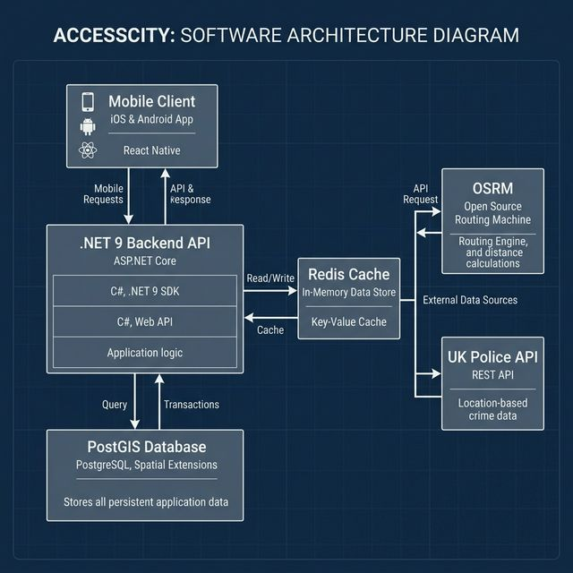

# AccessCity

Accessibility-first routing engine for urban navigation. It uses a combination of OSM road graphs, PostGIS spatial data, and real-time hazard reports to calculate paths based on street safety and physical accessibility.

Project Goal: Support **SDG 11 (Sustainable Cities)** by providing safe transport for persons with disabilities (Target 11.2) and improving public safety via community hazard tracking (Target 11.7).

---

## 🏛 Architecture



- **Backend**: .NET 9 Web API + EF Core
- **Frontend**: React Native (Expo) + MapLibre Native
- **Storage**: PostgreSQL + PostGIS (Geospatial indexing)
- **Cache**: Redis (Session & UK Police API data)
- **External APIs**: OSRM (Routing), Overpass (OSM import), UK Police (Crime data)

### Routing Logic
The engine uses a tiered lookup strategy:
1.  **Augmented OSRM**: Routes from OSRM are scored against local PostGIS obstacle data (stairs, kerb heights, surface type).
2.  **PostGIS A***: Fallback A* search performed directly on imported OSM road graphs.
3.  **Synthetic Grid**: High-density grid-based routing for areas with low OSM metadata density.

---

## 🌍 SDG 11 Alignment

Direct technical implementation of UN targets:
- **Target 11.2 (Safe & Accessible Transport)**: Implementation of profile-specific routing constraints (Manual vs. Electric Wheelchair) to ensure safe navigation for vulnerable populations.
- **Target 11.7 (Inclusive Public Space)**: Real-time hazard reporting and risk-weighted path-finding to mitigate physical and environmental risks in public areas.

---

## 🧪 Testing

- **Unit Tests**: 45+ tests for routing cost-functions, risk math, and DTO validation.
- **Integration Tests**: 40+ tests using `WebApplicationFactory` for auth flows, hazard persistence, and PostGIS performance.
- **Spatial Validation**: Automated verification of profile-based detours (e.g., ensuring wheelchair profiles bypass stairs).

**Commands:**
```bash
dotnet test
```

---

## ⚙️ Setup

### 1. Infrastructure (Docker)
```bash
docker-compose up -d
```

### 2. Backend (Port 5005)
```bash
cd AccessCity.API
dotnet run
```

### 3. Frontend (Web/Expo)
```bash
cd AccessCity.App
npm install
npm run web
```

---

## 🛠 Repository Layout

- `AccessCity.API`: API Layer & Controllers.
- `AccessCity.Domain`: Core Entities & Logic.
- `AccessCity.Infrastructure`: PostGIS Repositories & Clients.
- `AccessCity.App`: Mobile/Web Frontend.
- `AccessCity.Tests`: XUnit Test Suite.
